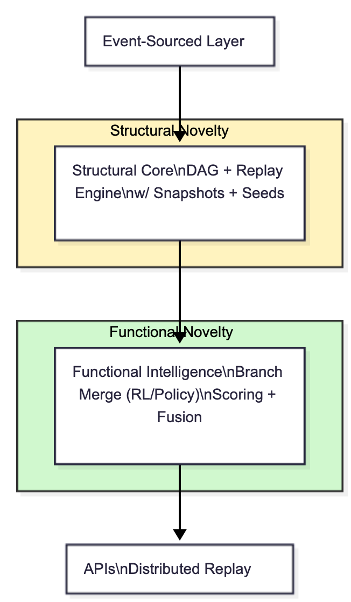

# CLE Lite — Git for LLMs™
**U.S. Patent Pending #63/909,873** (filed Nov 1, 2025)


**Branching AI chat memory** using `parent_id` events.
Edit a message → new branch, zero data loss.
Replay any path → LLM only loads the active branch.

## Architecture Overview


## The `ChatEvent` schema (public, patent-protected)
```protobuf
message ChatEvent {
  string event_id = 1; // ULID
  string parent_id = 2; // ← Git-style branching
  string session_id = 3;
  string user_id = 4;
  int64 ts_nanos = 5;
  enum Role { USER=0; AI=1; TOOL=2; }
  Role role = 6;
  bytes payload = 7;
}
```

## Redis Demo
```python
import redis, json
r = redis.Redis()

def add(msg, role=0, parent=None, session="demo"):
    evt = {
        "event_id": "01J...",
        "parent_id": parent or "",
        "session_id": session,
        "user_id": "matt",
        "ts_nanos": int(time.time_ns()),
        "role": role,
        "payload": msg
    }
    r.lpush(f"chat:{session}", json.dumps(evt))

# Test it
add("Hello")
add("Hey (edit)", parent="01J...")  # ← new branch!
```

## Install and Run
```bash
pip install redis
redis-server &
python -c "from your_script import add; [add(input()) for _ in range(3)]"
```

## Watch the Magic!
```bash
redis-cli lrange chat:demo 0 -1 | python -m json.tool
```

## Example Output - Branching in Action
When you edit a message and create a branch, here's what the event tree looks like:

```
=== Chat Event Tree ===
[0] USER: Hello, I need help with Python
    Event ID: 01J20981618668DB59661

  [1] AI: I'd be happy to help you with Python!
      Event ID: 01J2098161867269F4F50
      Parent ID: 01J20981618668DB59661

  [2] USER: Actually, I need help with JavaScript
      Event ID: 01J2098161867507918CF
      Parent ID: 01J20981618668DB59661  ← Branches from [0]!

  [3] AI: Sure, I can help you with JavaScript!
      Event ID: 01J2098161867E453A579
      Parent ID: 01J2098161867507918CF
```

Notice how event [2] branches directly from event [0], creating an alternative conversation path. Both branches are preserved - zero data loss!